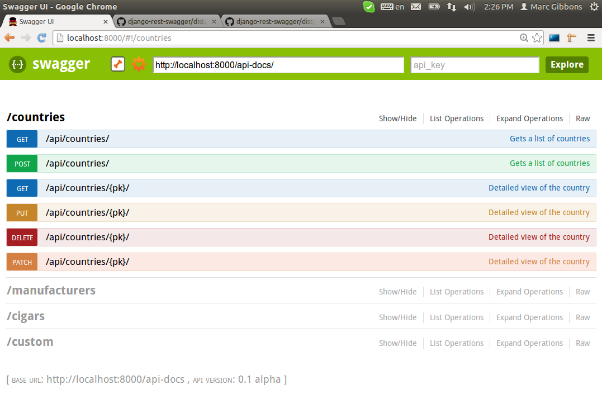
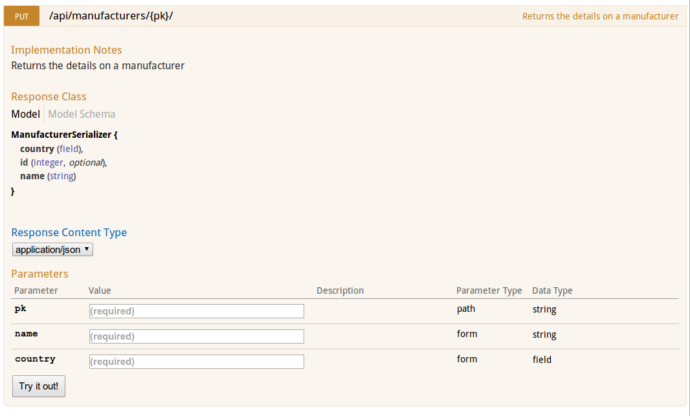

# Django REST Swagger

[](https://travis-ci.org/ariovistus/django-rest-swagger)

####An API documentation generator for Swagger UI and Django REST Framework version > 2.3.5

For older versions of Django REST Framework, see [Django REST Framework Docs](https://github.com/marcgibbons/django-rest-framework-docs)

## Installation
From PyPI: `pip install django-rest-swagger`

From source:
- Download the source
- Extract files
- Run `python setup.py install`

## Requirements
This application was developed and tested on:

* Django 1.5.1 - 1.6
* Django REST Framework 2.3.8+
* Python 2/3

Backwards compatibility for earlier Django & Django REST Framework versions will be added in a future release. Meanwhile, please use [Django REST Framework Docs](https://github.com/marcgibbons/django-rest-framework-docs) to document your projects.

## Quick start
**Note: This application will not work with Django REST Framework < 2.3**

1. Add `rest_framework_swagger` to your `INSTALLED_APPS` setting like this:

    ```python
        INSTALLED_APPS = (
            ...
            'rest_framework_swagger',
        )
    ```

2. Include the rest_framework_swagger URLs to a path of your choice

    ```python
    patterns = ('',
        ...
        url(r'^docs/', include('rest_framework_swagger.urls')),
    )
    ```

## Configuration
Further configuration can optionally be made from your project's `settings.py`.

* **Exclude namespaces:** you may wish to exclude a set of URLs from documentation. By default, all views that are subclassed from Django REST Framework APIView will be included for documentation
* **API Version:** your API's version. Default is blank.
* **Enabled methods:** You may specify the methods that can be interacted with in the UI
* **API key:** you can specify a key for your API. Default is blank

```python
SWAGGER_SETTINGS = {
    "exclude_namespaces": [], # List URL namespaces to ignore
    "api_version": '0.1',  # Specify your API's version
    "api_path": "/",  # Specify the path to your API not a root level
    "enabled_methods": [  # Specify which methods to enable in Swagger UI
        'get',
        'post',
        'put',
        'patch',
        'delete'
    ],
    "api_key": '', # An API key
    "is_authenticated": False,  # Set to True to enforce user authentication,
    "is_superuser": False,  # Set to True to enforce admin only access
    "permission_denied_handler": None, # If user has no permisssion, raise 403 error
}
```

## How It Works
This project is built on the [Django REST Framework Docs](https://github.com/marcgibbons/django-rest-framework-docs) and uses the lovely [Swagger from Wordnik](https://developers.helloreverb.com/swagger/) as an interface. This application introspectively generates documentation based on your Django REST Framework API code. Comments are generated in combination from code analysis and comment extraction. Here are some of the features that are documented:

* API title - taken from the class name
* Methods allowed
* Serializers & fields in use by a certain method
* Field default values, minimum, maximum, read-only and required attributes
* URL parameters (ie. /product/{id})
* Field `help_text` property is used to create the description from the serializer or model.
* Query parameters (user-defined) - Custom parameters. It is possible to customize a parameter list for your
    API. To do so, include a key-value pair in the docstring of your API class
    delimited by two hyphens ('--'). Example: 'start_time -- The first reading':

```python
    class Countries(APIView):
        """
        This text is the description for this API
        param1 -- A first parameter
        param2 -- A second parameter
        """
```

## Example
Included in this repository is a functioning example. Please clone the repo, copy or reference the `rest_framework_swagger` directory into the cigar_example folder. Install the required packages using `pip install -r requirements.txt`

## Screenshots



## Bugs & Contributions
Please report bugs by opening an issue

Contributions are welcome and are encouraged !

## Special Thanks
Thanks to [BNOTIONS](http://www.bnotions.com) for sponsoring initial development time.

Many thanks to Tom Christie & all the contributors who have developed [Django REST Framework](http://django-rest-framework.org/)

## Contributors
* Marc Gibbons (@marcgibbons)
* Geraldo Andrade (@quein)
* Vítek Pliska (@whit)
* Falk Schuetzenmeister (@postfalk)
* Lukas Hetzenecker (@lukas-hetzenecker)
* David Wolever (@wolever)
* Brian Moe (@bmoe)
* Ian Martin (@aztechian)
* @pzrq
* @jfelectron
* Warnar Boekkooi (@boekkooi)
* Darren Thompson (@WhiteDawn)
* Lukasz Balcerzak (@lukaszb)
* David Newgas (@davidn)
* Bozidar Benko (@bbenko)


### Django REST Framework Docs contributors:

* Scott Mountenay (@scottmx81)
* @swistakm
* Peter Baumgartner (@ipmb)
* Marlon Bailey (@avinash240)

## Release Notes:

### v0.1.14 (March 7, 2014)
* Fixed resource name truncation bug

### v0.1.13 (Feb 25, 2014)
* Fixed grouping bug

### v0.1.12 (Feb 24, 2014)
* Improved resource grouping
* Alphabetical sorting of resources
* Fixed CSRF headers
* Misc bug fixes & improvements

### v0.1.11 (Dec 1, 2013)
* Added proper unicode support for Python 2
* Compatibility fixes for Python 3
* Changed settings template var to avoid naming conflicts
* Fixed mapping dict constructor in introspectors for Python 2.6 support

### v0.1.10 (Nov 23, 2013)
* Upgraded Swagger UI version
* Now supports Django ViewSet method-level documentation
* Now supports ViewSet @action & @link method implementation
* Added blank HttpRequest to the callback for those who like to hack the get_serializer classes
* HTML Markdown supported in docstrings (use responsibly)

### v0.1.9 (Oct 1, 2013)
* Revisited doc algorithm
* Added support for APPEND_SLASH = False

### v0.1.8 (Sept 16, 2013)
* Fixed broken imports - Now supports DRF 2.3.8
* Added description on the model field

### v0.1.7 (Sept 4, 2013)
* URL flattening fixes
* API root prefix fix

### v0.1.6 (August 3, 2013)
* Improvments and bug fixes with relative imports in Python 3
* throbber.gif image is being pointed to local copy

### v0.1.5 (July 30, 2013)
* Added permission settings for Swagger docs. Default is now allow any, which will override REST Framework settings
* Fixed throbber.gif URL in the swagger-ui.min.js to point to Wordnik's resource


License
--------
Copyright (c) 2013, Marc Gibbons
All rights reserved.

Redistribution and use in source and binary forms, with or without
modification, are permitted provided that the following conditions are met:

1. Redistributions of source code must retain the above copyright notice, this
   list of conditions and the following disclaimer.
2. Redistributions in binary form must reproduce the above copyright notice,
   this list of conditions and the following disclaimer in the documentation
   and/or other materials provided with the distribution.

THIS SOFTWARE IS PROVIDED BY THE COPYRIGHT HOLDERS AND CONTRIBUTORS "AS IS" AND
ANY EXPRESS OR IMPLIED WARRANTIES, INCLUDING, BUT NOT LIMITED TO, THE IMPLIED
WARRANTIES OF MERCHANTABILITY AND FITNESS FOR A PARTICULAR PURPOSE ARE
DISCLAIMED. IN NO EVENT SHALL THE COPYRIGHT OWNER OR CONTRIBUTORS BE LIABLE FOR
ANY DIRECT, INDIRECT, INCIDENTAL, SPECIAL, EXEMPLARY, OR CONSEQUENTIAL DAMAGES
(INCLUDING, BUT NOT LIMITED TO, PROCUREMENT OF SUBSTITUTE GOODS OR SERVICES;
LOSS OF USE, DATA, OR PROFITS; OR BUSINESS INTERRUPTION) HOWEVER CAUSED AND
ON ANY THEORY OF LIABILITY, WHETHER IN CONTRACT, STRICT LIABILITY, OR TORT
(INCLUDING NEGLIGENCE OR OTHERWISE) ARISING IN ANY WAY OUT OF THE USE OF THIS
SOFTWARE, EVEN IF ADVISED OF THE POSSIBILITY OF SUCH DAMAGE.
