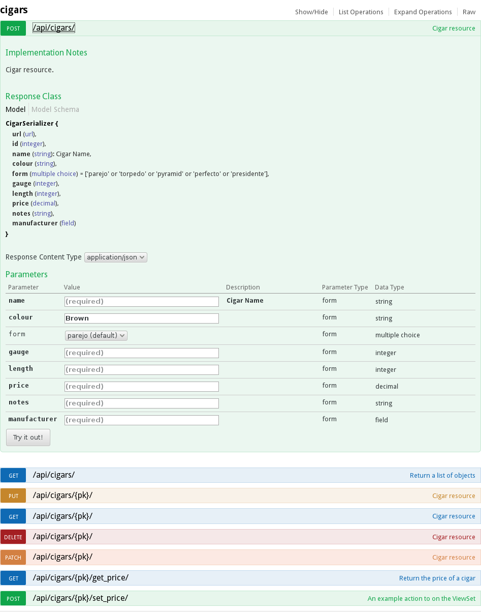
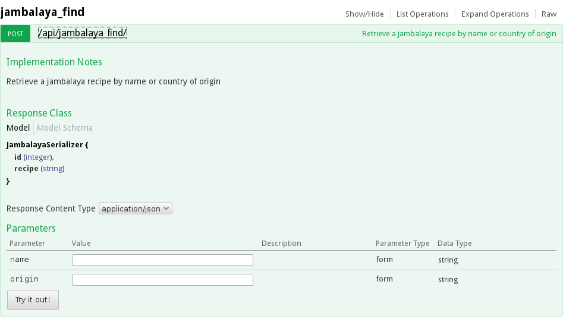
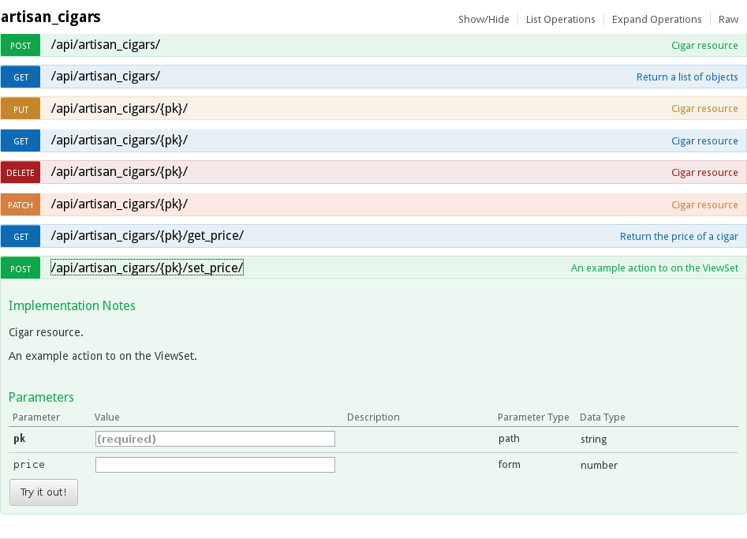

Examples
========
Basic Example with a ViewSet
----------------------------

Consider the following ViewSet:

.. literalinclude:: ../../tests/cigar_example/cigar_example/restapi/views.py
   :pyobject: CigarViewSet

with supporting model and serializer: 

.. literalinclude:: ../../tests/cigar_example/cigar_example/app/models.py
    :pyobject: Cigar

.. literalinclude:: ../../tests/cigar_example/cigar_example/restapi/serializers.py
   :pyobject: CigarSerializer

From this code, django-rest-swagger will produce the following swagger docs:

Function Based Views
--------------------
django-rest-swagger also supports function based views. Since the
serializers used by a function based view are not readily introspect-able,
you can use the yaml parser to manually provide them.

This example also illustrates support for markdown.

.. literalinclude:: ../../tests/cigar_example/cigar_example/restapi/views.py
    :pyobject: find_jambalaya

YAML in the class docstring
---------------------------
You can put yaml in the class-level docstring of your view. It must be nested in
the name of the method of interest:

.. literalinclude:: ../../tests/cigar_example/cigar_example/restapi/views.py
    :pyobject: ArtisanCigarViewSet

..
    Other things we need to show (and implement..): 
    * how to provide response classes
    * how to make swagger accept raw json (#131)
    * how to generate header parameters
    * how to use exclude_namespace (#64)
    * how to customize grouping of apis
    * how to have multiple swagger api sets (#141)
    * how to override absolute url (#83)
    * how to suppress calling get_serializer_class (#86)
        - or how to mock request? 

